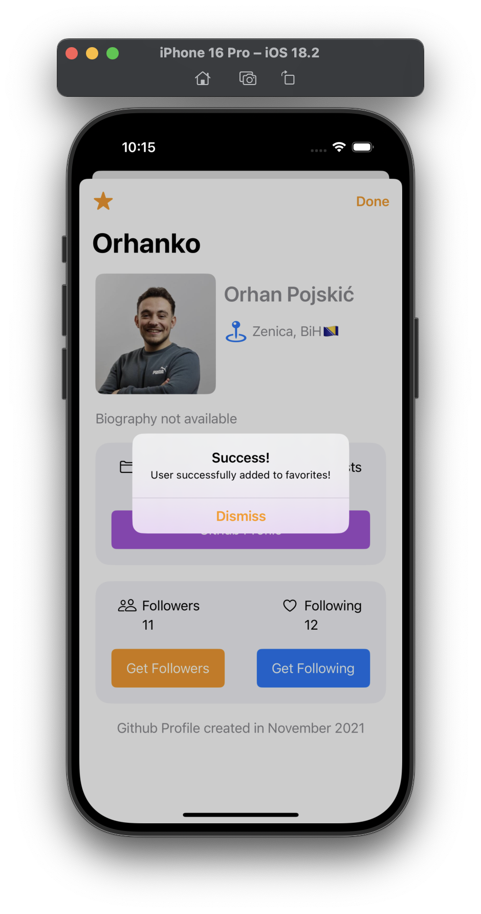

# GitHub Followers List

Meet GitHub Followers List, an iOS personal portfolio project (made using UIKit) that lets you explore GitHub profiles. You can search for profiles, find out who follows, and which profiles follow specific user. Or, you can just dive into the profiles you're interested in. The app's interface is designed to work well with the GitHub API, making it easy and intuitive to use.

### App preview

 

**NOTE**: Be aware that the screenshots are only a partial representation of the application. The project is still in the development phase.
